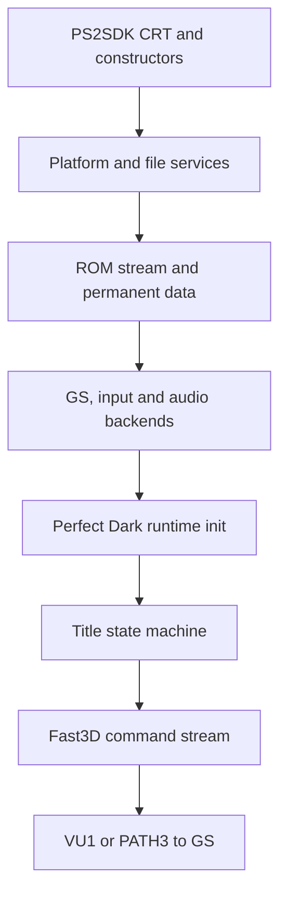

# PS2 startup and first-frame chain

Current frontier reviewed: 2026-09-18.

This document maps the retail-console execution path from the PS2SDK entry point through the normal game frame. It also preserves dated bring-up observations because they explain several renderer and logging decisions.

For the current project priorities and branch workflow, use [PS2_DEVELOPMENT.md](PS2_DEVELOPMENT.md). Dated build observations below are historical evidence unless explicitly labelled as the current implementation.

## Current hardware frontier

Retail PlayStation 2 testing has progressed beyond the original first-frame bring-up. With synchronous file logging disabled, the normal game ELF has reached:

```text
LEGAL / Expansion Pak screen
 -> Rare logo
 -> Nintendo 64 logo
 -> Perfect Dark logo
 -> main menu
 -> mission loading
```

Controller detection, EEPROM creation, GS presentation, VU1/PATH1 transport and PATH3 fallback have all been exercised on real hardware.

Startup reachability is therefore no longer the primary blocker. The current work is renderer correctness and performance: missing/incorrect materials, unsupported combiner recipes, framebuffer effects, texture/filter fidelity, synchronization validation and display-list safety.

The old roughly-one-frame-per-four-seconds title observation remains useful as historical performance evidence, not as the current canonical performance statement.

## Logging and timing rules

Durable USB filesystem logging must not run in frame-critical code. The file sink remains disabled in normal builds because synchronous `mass:` writes have already been shown to stall frame progress on tested hardware.

Diagnostic lines `PS2 frame video` measure full `gfx_run` and `gfx_end_frame` durations. `PS2 frame runtime` measures scheduler-start plus `mainTick`, scheduler-end, and their total, excluding the outer frame gate. Rendering happens within `mainTick`, so these timings overlap and must not be added together.

Renderer counters, explicit snapshots and the binary renderer trace are preferred for current graphics diagnosis. See [PS2_RENDERER_TRACE.md](PS2_RENDERER_TRACE.md).

## Execution overview



The port deliberately initializes PAD and SPU2 before graphics DMA ownership,
then finishes ROM streaming before entering the game. This ordering has already
survived on retail hardware and should not be changed casually.

## Phase 1: process and platform bootstrap

| Order | Owner | Work | Failure policy |
| --- | --- | --- | --- |
| 1 | PS2SDK CRT/linker | Enters the ELF at `_start`, establishes the C runtime and invokes constructors. | Toolchain/ABI failure, normally no application log. |
| 2 | `port/src/main.c` | Parses arguments and starts the crash/logger layer. | Continue only when logging is optional. |
| 3 | `port/ps2/system_ps2.c` | Derives the launch-device base path, initializes PS2 platform services and optionally opens `pdps2.log`. | Fatal hold for required services. |
| 4 | `port/src/fs.c` | Selects base/save directories and validates filesystem access. | Fatal hold. |
| 5 | `port/src/config.c` | Registers defaults, loads `pd.ini`, or creates a default file when none exists. | Invalid individual values fall back to registered defaults; required I/O errors are logged. |
| 6 | `port/ps2/input_ps2.c` | Initializes SIF/RPC, PADMAN and DualShock 2 state. | Warning and continued boot so controller failure is diagnosable. |
| 7 | `port/ps2/audio_ps2.c` | Loads embedded `audsrv.irx` and initializes SPU2 output. | Warning; the game audio heap is disabled for this run. |

Device-qualified paths such as `mass:`, `host:`, `mc0:` and `pfs0:` are
absolute. Relative runtime files are rooted beside the ELF unless `--basedir`
or `--savedir` overrides that behavior.

## Phase 2: ROM materialization

`port/src/romdata.c` opens the legally supplied NTSC-final ROM and validates its
header. The PS2 path keeps the ROM file-backed instead of copying the complete
32 MiB image into EE RAM.

The materialization sequence is:

1. validate the ROM type and expected file size;
2. inflate the compressed permanent data segment with bounded input and output;
3. expose named permanent segments used by the portable game;
4. initialize the ROM file table and file-name table;
5. retain file offsets so later asset reads can stream only the requested
   range;
6. validate every PS2 runtime patch offset before applying it.

Short reads, malformed RZIP headers, decompression that does not reach
`Z_STREAM_END`, output overflow, and invalid patch offsets now fail explicitly.
They are no longer allowed to masquerade as a successful asset load.

## Phase 3: video and game heap

`port/ps2/video_ps2.c::videoInit` initializes the native GS core and the patched
Fast3D frontend. `port/src/main.c` then calls `gameInit`, creates the portable
scheduler facade and allocates the single game heap.

The reported game-heap size becomes both `g_OsMemSize` and `osMemSize`, keeping
the original game heuristics consistent with memory that is actually owned by
the process. Failure to obtain the heap is fatal before the game can write
through a null pointer.

The selected stage defaults to `STAGE_TITLE` (`0x5a`). `--skip-intro` redirects
it to CI Training and `--boot-stage` can select another numeric stage for
bring-up.

## Phase 4: portable runtime initialization

`port/src/pdmain.c::mainProc` emits durable checkpoints around the three major
steps:

| Checkpoint | Important work behind it |
| --- | --- |
| `mainInit begin` | Entry into the reconstructed Perfect Dark runtime. |
| `mainInit complete; rdpInit begin` | Fault/DMA/audio-manager shims, variables, memory pools, controller facade, VI state, file table, permanent game systems and `titleInit`. |
| `rdpInit complete; sndInit begin` | RDP output buffers and scheduler-facing graphics state. |
| `sndInit complete; mainLoop begin` | Sound tables and buffers, or the deliberately disabled sound path. |

Critical permanent allocations in RDP, sound, MEMA, VI and per-frame Gfx/Vtx
setup are checked. An allocation failure now names the subsystem and enters the
fatal hold instead of continuing into address zero.

The two-bank `memp` allocator probes the onboard bank before the expansion
bank. Exhausting only the first bank is normal fallback, so it is no longer
reported as an error. A PS2 `mempAlloc` error now means that neither bank could
satisfy the request and reports the remaining capacity in both banks.

## Phase 5: title sequence

The title state machine is owned by `src/game/title.c`. The relevant early path
is:

```text
legal / product-identification screen with Expansion Pak status
  -> controller check
  -> Rare logo model load
  -> Rare logo model instantiation
  -> first Rare logo modelRender
  -> Nintendo logo / PD logo / title menu
```

The controller warning is conditional. Its absence on hardware proves that the
portable controller facade sees PAD port 0; it does not by itself prove that
every game binding and rumble path works.

The Rare-logo boundary has dedicated durable messages:

```text
title: Rare logo load begin ...
title: Rare logo model loaded ...
title: Rare logo model instantiated ...
title: Rare logo init complete
title: Rare logo first render begin ...
title: Rare logo relations ready ...
title: Rare logo first model pass complete
title: Rare logo first render complete
```

The model path is now fail-fast:

1. `modeldefLoad` asks `fileLoad` for the ROM-backed model;
2. `fileLoad` validates the table entry, destination capacity and file read;
3. compressed input remains in its separate `romdata` buffer;
4. `rzipInflateSized` writes into the full bounded destination and must reach
   the end of the stream;
5. preprocessing checks its temporary allocation;
6. model definitions used by the title sequence must have a root node and at
   least one matrix;
7. title-arena, model-slot and model RW-data allocations are checked before
   pointer walking or instance initialization;
8. only a successful model definition and instance reach relation updates and
   rendering.

This removes the previous unsigned tail-placement underflow and the case where
a failed file read still returned a destination pointer.

## Phase 6: one rendered frame

Every game frame follows this ownership chain:

| Step | Function or component | Result |
| --- | --- | --- |
| Frame begin | `schedStartFrame` -> `videoStartFrame` | Opens the Fast3D/GS frame. |
| Game production | `mainTick` -> `lvTick` / `lvRender` | Builds N64-style `Gfx` commands and transient matrices/vertices. |
| Task submission | `rdpCreateTask` -> `port/src/pdsched.c::schedSubmitTask` | Routes a graphics task directly to the portable video bridge. |
| Frontend | `videoSubmitCommands` -> patched `gfx_run` | Interprets GBI commands and live TMEM operations. |
| Planning | `port/ps2/gfx_ps2.cpp` | Maps state and combiner recipes to one or more GS passes. |
| Native transport | `gs_core`, `gs_native_queue`, `gs_vu1_*` | Uses VIF1/VU1 PATH1 where supported and PATH3 fallback otherwise. |
| Presentation | `gfx_end_frame` -> `ps2GsCorePresent` | Waits for the appropriate synchronization and flips at VBlank. |
| Frame end | `schedEndFrame` | Polls PAD/audio, applies VI blanking to the active frame and advances the delayed-unblank state. |

The portable scheduler does not launch a separate RSP. It preserves the game
task boundary but executes the graphics task synchronously through the PS2
backend.

`osViBlack` is implemented as persistent output state on PS2. While blanking is
active, `videoEndFrame` appends a black colour/depth clear to the already-open
frame before its single submit and presentation. It must not call
`videoClearScreen` from `viHandleRetrace`: that would open a nested Fast3D/GS
frame, reset the native command arena after game submission and perform an
extra VBlank presentation from inside the scheduler.

`viBlack(false)` is intentionally delayed rather than immediate. It initializes
a countdown equal to the emulated framebuffer count so stale buffers cannot
flash on screen. The portable scheduler already decrements that value in
`__scUpdateViMode`, once per presented frame after `viHandleRetrace` applies
the current state. Do not also decrement it in `schedEndFrame`: this would
halve the intended delay. A host regression test covers the countdown and
the permanent-black sentinel. The missing countdown hypothesis for the
2026-09-05 hardware log was rejected on inspection of the full scheduler.

### LEGAL-screen diagnostic build

The `pdps2(20260905-094506).log` capture ends at `stage reset complete; frame
loop begin`. It does not establish which call stopped progress afterwards,
or prove that VI blanking caused the black screen. The added first-frame
checkpoints distinguish the frame gate, native frame begin, timing, `lvTick`,
`lvRender`, synchronous graphics-task execution and presentation. They run
only for the first frame of each stage. A one-shot warning reports a frame
gate that still has not opened after five seconds, provided the system clock
continues advancing. This is observation only, not an automatic reset,
stage skip or timeout recovery.

Title-mode application is logged separately, including controller detection
and Rare-logo entry. Existing file-backed logging can itself block or fail;
the last durable line is a boundary for investigation, not proof that the
next source line crashed. Retest this build on hardware before attributing
the original failure to any single subsystem.

### Correct-logo performance baseline

The `aaad5659` hardware capture on 2026-09-06 confirms that the Rare, Nintendo
64 and Perfect Dark logos render correctly. The first frame reports 527
translated batches and 3162 vertices in 17.154 ms of EE translation, while
the complete frame takes 217.705 ms. A later logo frame spends 650.209 ms in
`schedEndFrame`, which contains the final GS completion fence and VBlank wait.
This rules out vertex translation as the dominant title bottleneck and points
at queued GS pass work.

The exact alpha-bearing trilerp graph is especially expensive: each 128x64
tile uses two CT32 scratch targets, several texture/composite passes and up to
512 independent 8x2 channel-shuffle sprites. Constant LOD endpoints are
theoretically reducible to one source texture, but the default correctness
baseline deliberately retains the tiled graph for every factor after the
endpoint A/B build failed the post-LEGAL hardware test.

The `d1556ac4` Og/O2 hardware run exposed a regression in the later broad
complex-material fallbacks: LEGAL text looked displaced and neither run
reached the Rare, Nintendo 64 or Perfect Dark logos. Both logs stop after
`stage reset complete; frame loop begin`, so they contain no completed-frame
telemetry and do not distinguish a long first GS fence from a failed file-sink
reopen. The matching visual regression nevertheless invalidates the unproved
RGB substitutions.

The `a56bacda` test build retained exact tiled graphs for non-endpoint
trilerp, while allowing endpoint collapse and a direct independent-alpha draw
only for textures whose RGB lanes were proven white during upload. It also
recorded endpoint, tile and GS FINISH counters outside the measured frame
interval. Those remaining specializations still failed the hardware title
test described below, so they are no longer active in the default build.

The `a56bacda` Og hardware run on 2026-09-15 still displayed LEGAL but did not
display the Rare, Nintendo 64 or Perfect Dark logos. Its durable log again
ends at `stage reset complete; frame loop begin`, without a completed-frame
snapshot. This rejects the proof-gated partial rollback as sufficient.

The active renderer has therefore been returned to the `aaad5659`
hardware-confirmed behavior. The endpoint trilerp collapse, white-texture
direct-alpha path, GS FINISH timing wrapper and their extra hot-path counters
are removed together. The C-safe integer checkpoint ABI and build-profile
labelling remain because they do not alter draw or synchronization behavior.
This is a correctness baseline, not a performance improvement.

The subsequent `46bc51e7` Og hardware run on 2026-09-15 still displayed LEGAL
but did not display the Rare, Nintendo 64 or Perfect Dark logos. Its durable
log again ends at `stage reset complete; frame loop begin`. The original
`aaad5659` CI #245 game artifact remains the binary control because the current
and historical ELFs differ only in the build-profile log/ABI changes and their
resulting eight-byte text layout shift. Test that exact historical ELF from a
clean directory before assigning the failure to renderer source.

**POTWIERDZONE, retail PS2, 2026-09-15:** `pd-ps2-game-nolog` passed LEGAL,
rendered the Rare, Nintendo 64 and Perfect Dark logos, entered the main menu
and loaded missions. The same source with the file sink enabled stopped making
visible progress after LEGAL. This isolates the apparent title regression to
blocking filesystem logging on `mass:`, not the renderer or title state
machine.

The first menu/mission photographs from that run establish two separate visual
fault classes. CI4 font glyphs are readable but contain repeatable displaced
scanline groups on LEGAL, menu and HUD screens. Three-dimensional scenes also
contain long triangles and disconnected textured slabs, while the game state,
collision and HUD continue running. These observations do not support treating
the result as one Z-buffer bug: the 2D corruption exists without world depth,
and incorrect depth testing cannot manufacture new stretched triangle edges.

CI now publishes `pd-ps2-game-safe` as a retail-hardware correctness control.
It consumes the same authoritative TMEM view but lets the portable importer
expand CI/IA/I 4-bit and 8-bit textures to CT32, removing native PSMT4/PSMT8
IMAGE, TBW and CLUT layout from the font experiment. It also compiles the full
game without the VU1/PATH1 transform define, forcing the existing EE/PATH3
fallback for geometry. The normal artifact is unchanged. Because this combined
control changes both texture residency and transform transport, it is useful
as a conservative build but cannot by itself assign a corrected glyph to one
subsystem. The orthogonal `pd-ps2-game-ee` artifact below removes that
ambiguity.

Source comparison with the SM64 PS2 port identified a missing prerequisite in
that initial A/B: SM64 explicitly enables six-plane homogeneous clipping for
PS2 because the GS does not provide the desktop GPU clip stage. Perfect Dark's
frontend only rejected triangles wholly outside one shared plane. The PS2
backend then divided partially visible triangles by W and clamped the resulting
screen coordinates to the GS range, which can turn an eye-plane crossing into
the photographed full-screen spikes.

The PS2 backend now clips every triangle against `-W <= X,Y <= W` and
`0 <= Z <= W` before either the EE/PATH3 or VU1/PATH1 transform. Newly created
vertices interpolate the complete active VBO record, including UV, fog and
combiner inputs, and are triangulated into bounded batches. Host tests cover
near-plane attribute interpolation, negative-W input, complete rejection,
insufficient output capacity and 10,000 deterministic random triangles. This
fix is shared by both geometry transports; the older pre-clip `safe` artifact
remains useful only for isolating indexed texture residency and VU1 behavior.

Current CI publishes three full-game corners so the font result is not
confounded with the transform selection:

| Artifact | Indexed textures | Geometry transform |
| --- | --- | --- |
| `pd-ps2-game` | native PSMT4/PSMT8 | VU1/PATH1 |
| `pd-ps2-game-ee` | native PSMT4/PSMT8 | EE/PATH3 |
| `pd-ps2-game-safe` | expanded CT32 | EE/PATH3 |

Compare `game` with `game-ee` to isolate VU1, then `game-ee` with `game-safe`
to isolate indexed GS residency. All three contain the same homogeneous
clipper, so a remaining difference is no longer attributable to eye-plane
crossings.

**POTWIERDZONE, retail PS2, 2026-09-16:** all three corners above and the
previous O2 artifact produce the same glyph corruption, black world and
stretched geometry as the original photographs. This rejects VU1/PATH1,
native indexed residency, compiler optimization and the missing homogeneous
clipper as primary causes of the photographed output. The expanded CT32 path
still consumes the same materialized TMEM view, so this result does not prove
that the upstream TMEM model is correct.

**CURRENT IMPLEMENTATION:** Fast3D emits texture coordinates normalized to
the logical uploaded width and height, while GS STQ addressing uses the
power-of-two extents encoded by `TEX0.TW/TH`. The backend previously forwarded
those values unchanged. A 7-pixel glyph therefore addressed an 8-pixel GS
extent, and analogous NPOT dimensions sampled padding or the following row.
The renderer now scales each axis by `logical_extent / 2^ceil(log2(extent))`
after accounting for a physically expanded mirror period. Host tests cover
POT, NPOT, mirrored and zero-sized contracts. **HIPOTEZA DO TESTU:** this exact
correction should change the repeatable font and icon corruption; it is not
claimed to repair black world materials or stretched geometry.

CI also publishes `pd-ps2-game-geometry-baseline`. It accepts supported and
unsupported shader recipes but renders every submitted triangle with an
untextured six-colour diagnostic palette through EE/PATH3. Alpha test,
blending, fog and material pass graphs are disabled while depth and the common
clip/viewport path remain active. If world geometry appears there, the black
output belongs to texture/material planning. If it remains absent or retains
the same spikes, investigate common positions, culling and depth state before
adding another combiner approximation.

**POTWIERDZONE, retail PS2, 2026-09-16:** the NPOT STQ correction fixes text
in the menu and gameplay HUD, but LEGAL remains corrupted. The normal build
otherwise retains the black world and earlier geometry faults. The untextured
geometry baseline renders the mission transition as solid geometry without
the characteristic spikes, but Carrington and loaded missions remain mostly
black, with only a few weapon or scene triangles appearing. This proves that
material graphs are not the only visibility failure. LEGAL now belongs to a
narrower texture/TMEM case than the corrected menu and HUD glyphs.

**CURRENT IMPLEMENTATION:** `ps2GsCoreClear(false, true)` previously inherited
the preceding draw's `ZBUF.ZMSK`, alpha/destination tests and scissor. A depth
clear issued after `Z_UPD=0` therefore wrote no depth at all. Conversely, a
colour-only clear could overwrite Z when depth writes happened to be enabled.
Stale reversed-Z values can reject distant world surfaces while allowing a few
near weapon triangles, matching the hardware symptom. Clear packets now force
independent FRAME/ZBUF masks, full-target scissor, disabled alpha/destination
tests and unblended sprites, then restore every persistent register.

**HIPOTEZA DO TESTU:** CI publishes two additional untextured EE/PATH3
controls. `geometry-no-cull` bypasses only Fast3D face culling;
`geometry-no-depth` bypasses only GS depth testing and writes. Compare both
against the repaired `geometry-baseline`. Do not promote either bypass to the
normal renderer: they are fault-isolation controls, not visual fixes.

**POTWIERDZONE, retail PS2, 2026-09-16:** after the state-independent clear
fix, `geometry-baseline` displays the mission map. Some submitted models still
cover the entire view at particular camera angles and can cover the weapon or
UI. The same occluders appear in `geometry-baseline`, `geometry-no-depth` and
`geometry-no-cull`. This rejects ordinary GS depth comparison and Fast3D face
culling as the cause of that diagnostic-only ordering symptom.

**CURRENT IMPLEMENTATION:** the original geometry baseline deliberately
forced every draw to an opaque palette, including alpha-blended, texture-edge
and invisible/depth-only draws. That turns legitimate masks, screen effects
and transparent planes into false solid occluders. CI now publishes two
narrower controls:

| Artifact | Accepted draws | Fragment source |
| --- | --- | --- |
| `pd-ps2-game-geometry-opaque` | Opaque-only geometry | Six-colour palette |
| `pd-ps2-game-material-opaque` | Opaque-only geometry | Direct `TEXEL0`, or palette when untextured |

Both use the corrected clear, homogeneous clipper, normal depth state and
EE/PATH3 transform. The first tests whether the apparent full-screen models
were created solely by flattening transparent/invisible draw classes. The
second bypasses combiner recipes and material pass graphs while preserving
texture upload, selection, STQ and clamp. **HIPOTEZA DO TESTU:** recognizable
world textures in `material-opaque` would place the normal build's black world
after texture residency, in combiner/pass planning; corrupted or absent direct
textures would keep the fault in texture materialization, selection or GS
sampling.

**POTWIERDZONE, retail PS2, 2026-09-16:** `geometry-opaque` removes the
camera-angle-dependent full-screen occluder, but also removes much of the game
because Perfect Dark marks a large fraction of its draws with alpha, texture
edge or invisible behavior. This identifies the occluder as one of those draw
classes rather than ordinary opaque geometry. `material-opaque` displays
recognizable TEXEL0 data on Joanna, the menu computer, Carrington doors and a
character model. The world is no longer uniformly black, although most draws
are still intentionally filtered. Texture upload, selection, STQ and GS
sampling therefore work for real game assets; the dominant black-world fault
lies later in RGB combiner/pass planning. Slight horizontal striping or texel
misalignment remains a separate sampling/layout defect.

**CURRENT IMPLEMENTATION:** CI now also publishes
`pd-ps2-game-material-alpha`. It continues to bypass RGB combiner recipes and
complex colour pass graphs, but retains source alpha blending, alpha threshold,
texture-edge rejection, invisible/depth-only writes and TEXEL0 alpha. For an
unsupported alpha graph it uses a conservative TEXEL0/input-alpha visibility
approximation instead of forcing the draw opaque. **HIPOTEZA DO TESTU:** this
build should retain most of the world while avoiding the false opaque screen
mask. It is a diagnostic visibility baseline, not an exact material renderer.

**CURRENT IMPLEMENTATION:** the renderer correctness pass found two backend
contract violations below material planning. Fast3D supplies viewport and
scissor rectangles in bottom-left-origin coordinates, while GS screen space is
top-left-origin; partial rectangles were therefore applied to the vertically
mirrored strip even though full-screen state appeared correct. The PS2 adapter
now converts both rectangles before projection, native SCISSOR programming and
pass-graph tiling. Separately, `depth_test=false` previously left `TEST.ZTE`
enabled with `ZTST=ALWAYS`, allowing `depth_update=true` to write invisible Z.
Depth-disabled draws now disable ZTE and force `ZBUF.ZMSK`, matching the
portable/OpenGL contract. Both transformations have host regression tests.

See `PS2_RENDERER_CORRECTNESS_AUDIT.md` for the reviewed texture/state
contracts and the remaining destination-colour, decal-depth, filtering and
combiner gaps.

The normal game build therefore keeps the file sink disabled. Console logging
remains active, `--file-log` opts into `pdps2.log`, and CI retains a separate
`pd-ps2-game-filelog` artifact for controlled diagnostics. No frame-critical
path may rely on synchronous filesystem progress.

## Fatal and hang interpretation

On PS2, `sysFatalError` writes the final error, forces a log checkpoint, closes
the file and parks the EE in `DelayThread`. The last image should remain and the
console should require a manual reset.

Use this distinction during bring-up:

| Observed result | Likely class |
| --- | --- |
| Last log says `FATAL:` and console remains running | Controlled validation, I/O or allocation failure. |
| Log stops between two documented checkpoints and console remains running | Infinite wait, deadlock or uninstrumented fatal path. |
| Console returns to OSD or resets without `FATAL:` | EE exception, memory corruption, DMA/VIF fault, explicit process return, or external reset. |
| Frame loop lives and Triangle/Select snapshots appear | Runtime and presentation survive; investigate renderer state/fidelity. |

## Remaining high-risk boundaries

1. Title, menu and mission execution now progress on retail hardware with the
   file sink disabled. Texture/material fidelity and missing effects, rather
   than startup reachability, are the primary renderer problem.
2. Central Vtx/Mtx/colour allocations now fail before crossing their active
   frame arena, and the PS2 master display list is checked at frame phase
   boundaries. Direct display-list writers still need per-writer reservations
   or a protected trailing region to prevent damage before a post-phase check.
3. Unsupported combiner recipes are counted and dropped, so a healthy frame
   loop can still produce an empty image. The first dropped draw schedules an
   end-of-frame durable checkpoint containing its shader ID; periodic and
   controller snapshots report dropped batch/triangle totals as
   `unsupported=B/T`.
4. Offscreen framebuffer effects, framebuffer copies and mipmaps are not yet
   implemented.
5. Some preprocessors estimate output space and validate after conversion;
   they need writer-side bounds for hostile or corrupt input.
6. `bootAllocateStack` is a shared static compatibility stub. It is safe only
   while the portable scheduler remains single-threaded on this path.
7. Text, alpha/blend fidelity and synchronization hazards require retail GS/VU
   validation even when host tests pass.

## Hardware log checklist

For normal hardware tests, record the ELF checksum, scene, visible corruption
and whether menu/mission progress remains intact. Enable `pdps2.log` only in a
controlled diagnostic run; its synchronous `mass:` path is known to stop frame
progress on the tested console/storage combination.
