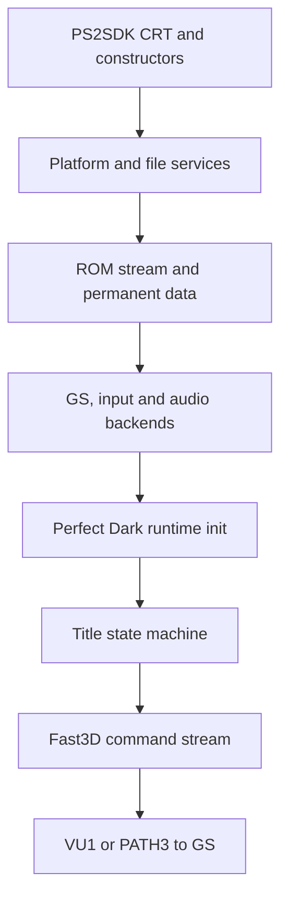

# PS2 startup and first-frame chain

This document describes the `ps2` branch as audited on 2026-09-03. It follows
the retail-console path from the PS2SDK entry point to the first normal 3D
title frame. It is intended both as a maintenance map and as a checklist for
hardware logs.

The last hardware-confirmed screen is the legal/product-identification page,
including its Expansion Pak status. Controller detection and EEPROM creation
have also been confirmed. The first Rare-logo 3D frame remains the next
unproven boundary.

## Execution overview



The port deliberately initializes PAD and SPU2 before graphics DMA ownership,
then finishes ROM streaming before entering the game. This ordering has already
survived on retail hardware and should not be changed casually.

## Phase 1: process and platform bootstrap

| Order | Owner | Work | Failure policy |
| --- | --- | --- | --- |
| 1 | PS2SDK CRT/linker | Enters the ELF at `_start`, establishes the C runtime and invokes constructors. | Toolchain/ABI failure, normally no application log. |
| 2 | `port/src/main.c` | Parses arguments and starts the crash/logger layer. | Continue only when logging is optional. |
| 3 | `port/ps2/system_ps2.c` | Derives the launch-device base path, initializes PS2 platform services and opens `pdps2.log`. | Fatal hold for required services. |
| 4 | `port/src/fs.c` | Selects base/save directories and validates filesystem access. | Fatal hold. |
| 5 | `port/src/config.c` | Registers defaults, loads `pd.ini`, or creates a default file when none exists. | Invalid individual values fall back to registered defaults; required I/O errors are logged. |
| 6 | `port/ps2/input_ps2.c` | Initializes SIF/RPC, PADMAN and DualShock 2 state. | Warning and continued boot so controller failure is diagnosable. |
| 7 | `port/ps2/audio_ps2.c` | Loads embedded `audsrv.irx` and initializes SPU2 output. | Warning; the game audio heap is disabled for this run. |

Device-qualified paths such as `mass:`, `host:`, `mc0:` and `pfs0:` are
absolute. Relative runtime files are rooted beside the ELF unless `--basedir`
or `--savedir` overrides that behavior.

## Phase 2: ROM materialization

`port/src/romdata.c` opens the legally supplied NTSC-final ROM and validates its
header. The PS2 path keeps the ROM file-backed instead of copying the complete
32 MiB image into EE RAM.

The materialization sequence is:

1. validate the ROM type and expected file size;
2. inflate the compressed permanent data segment with bounded input and output;
3. expose named permanent segments used by the portable game;
4. initialize the ROM file table and file-name table;
5. retain file offsets so later asset reads can stream only the requested
   range;
6. validate every PS2 runtime patch offset before applying it.

Short reads, malformed RZIP headers, decompression that does not reach
`Z_STREAM_END`, output overflow, and invalid patch offsets now fail explicitly.
They are no longer allowed to masquerade as a successful asset load.

## Phase 3: video and game heap

`port/ps2/video_ps2.c::videoInit` initializes the native GS core and the patched
Fast3D frontend. `port/src/main.c` then calls `gameInit`, creates the portable
scheduler facade and allocates the single game heap.

The reported game-heap size becomes both `g_OsMemSize` and `osMemSize`, keeping
the original game heuristics consistent with memory that is actually owned by
the process. Failure to obtain the heap is fatal before the game can write
through a null pointer.

The selected stage defaults to `STAGE_TITLE` (`0x5a`). `--skip-intro` redirects
it to CI Training and `--boot-stage` can select another numeric stage for
bring-up.

## Phase 4: portable runtime initialization

`port/src/pdmain.c::mainProc` emits durable checkpoints around the three major
steps:

| Checkpoint | Important work behind it |
| --- | --- |
| `mainInit begin` | Entry into the reconstructed Perfect Dark runtime. |
| `mainInit complete; rdpInit begin` | Fault/DMA/audio-manager shims, variables, memory pools, controller facade, VI state, file table, permanent game systems and `titleInit`. |
| `rdpInit complete; sndInit begin` | RDP output buffers and scheduler-facing graphics state. |
| `sndInit complete; mainLoop begin` | Sound tables and buffers, or the deliberately disabled sound path. |

Critical permanent allocations in RDP, sound, MEMA, VI and per-frame Gfx/Vtx
setup are checked. An allocation failure now names the subsystem and enters the
fatal hold instead of continuing into address zero.

## Phase 5: title sequence

The title state machine is owned by `src/game/title.c`. The relevant early path
is:

```text
legal / product-identification screen with Expansion Pak status
  -> controller check
  -> Rare logo model load
  -> Rare logo model instantiation
  -> first Rare logo modelRender
  -> Nintendo logo / PD logo / title menu
```

The controller warning is conditional. Its absence on hardware proves that the
portable controller facade sees PAD port 0; it does not by itself prove that
every game binding and rumble path works.

The Rare-logo boundary has dedicated durable messages:

```text
title: Rare logo load begin ...
title: Rare logo model loaded ...
title: Rare logo model instantiated ...
title: Rare logo init complete
title: Rare logo first render begin ...
title: Rare logo relations ready ...
title: Rare logo first model pass complete
title: Rare logo first render complete
```

The model path is now fail-fast:

1. `modeldefLoad` asks `fileLoad` for the ROM-backed model;
2. `fileLoad` validates the table entry, destination capacity and file read;
3. compressed input remains in its separate `romdata` buffer;
4. `rzipInflateSized` writes into the full bounded destination and must reach
   the end of the stream;
5. preprocessing checks its temporary allocation;
6. model definitions used by the title sequence must have a root node and at
   least one matrix;
7. title-arena, model-slot and model RW-data allocations are checked before
   pointer walking or instance initialization;
8. only a successful model definition and instance reach relation updates and
   rendering.

This removes the previous unsigned tail-placement underflow and the case where
a failed file read still returned a destination pointer.

## Phase 6: one rendered frame

Every game frame follows this ownership chain:

| Step | Function or component | Result |
| --- | --- | --- |
| Frame begin | `schedStartFrame` -> `videoStartFrame` | Opens the Fast3D/GS frame. |
| Game production | `mainTick` -> `lvTick` / `lvRender` | Builds N64-style `Gfx` commands and transient matrices/vertices. |
| Task submission | `rdpCreateTask` -> `port/src/pdsched.c::schedSubmitTask` | Routes a graphics task directly to the portable video bridge. |
| Frontend | `videoSubmitCommands` -> patched `gfx_run` | Interprets GBI commands and live TMEM operations. |
| Planning | `port/ps2/gfx_ps2.cpp` | Maps state and combiner recipes to one or more GS passes. |
| Native transport | `gs_core`, `gs_native_queue`, `gs_vu1_*` | Uses VIF1/VU1 PATH1 where supported and PATH3 fallback otherwise. |
| Presentation | `gfx_end_frame` -> `ps2GsCorePresent` | Waits for the appropriate synchronization and flips at VBlank. |
| Frame end | `schedEndFrame` | Polls PAD/audio, applies VI blanking to the active frame and advances the delayed-unblank state. |

The portable scheduler does not launch a separate RSP. It preserves the game
task boundary but executes the graphics task synchronously through the PS2
backend.

`osViBlack` is implemented as persistent output state on PS2. While blanking is
active, `videoEndFrame` appends a black colour/depth clear to the already-open
frame before its single submit and presentation. It must not call
`videoClearScreen` from `viHandleRetrace`: that would open a nested Fast3D/GS
frame, reset the native command arena after game submission and perform an
extra VBlank presentation from inside the scheduler.

## Fatal and hang interpretation

On PS2, `sysFatalError` writes the final error, forces a log checkpoint, closes
the file and parks the EE in `DelayThread`. The last image should remain and the
console should require a manual reset.

Use this distinction during bring-up:

| Observed result | Likely class |
| --- | --- |
| Last log says `FATAL:` and console remains running | Controlled validation, I/O or allocation failure. |
| Log stops between two documented checkpoints and console remains running | Infinite wait, deadlock or uninstrumented fatal path. |
| Console returns to OSD or resets without `FATAL:` | EE exception, memory corruption, DMA/VIF fault, explicit process return, or external reset. |
| Frame loop lives and Triangle/Select snapshots appear | Runtime and presentation survive; investigate renderer state/fidelity. |

## Remaining high-risk boundaries

1. The first Rare-logo display list has not yet completed on confirmed retail
   hardware with the hardened loader.
2. Central Vtx/Mtx/colour allocations now fail before crossing their active
   frame arena, and the PS2 master display list is checked at frame phase
   boundaries. Direct display-list writers still need per-writer reservations
   or a protected trailing region to prevent damage before a post-phase check.
3. Unsupported combiner recipes are counted and dropped, so a healthy frame
   loop can still produce an empty image. The first dropped draw schedules an
   end-of-frame durable checkpoint containing its shader ID; periodic and
   controller snapshots report dropped batch/triangle totals as
   `unsupported=B/T`.
4. Offscreen framebuffer effects, framebuffer copies and mipmaps are not yet
   implemented.
5. Some preprocessors estimate output space and validate after conversion;
   they need writer-side bounds for hostile or corrupt input.
6. `bootAllocateStack` is a shared static compatibility stub. It is safe only
   while the portable scheduler remains single-threaded on this path.
7. Text, alpha/blend fidelity and synchronization hazards require retail GS/VU
   validation even when host tests pass.

## Hardware log checklist

For the next title test, preserve the complete `pdps2.log`. The first missing
line in the Rare-logo sequence identifies whether the remaining failure is in
file materialization, model preprocessing/instantiation, relation building,
the first model display list, or submission to GS. Also record whether the
machine held, reset or returned to OSD.
